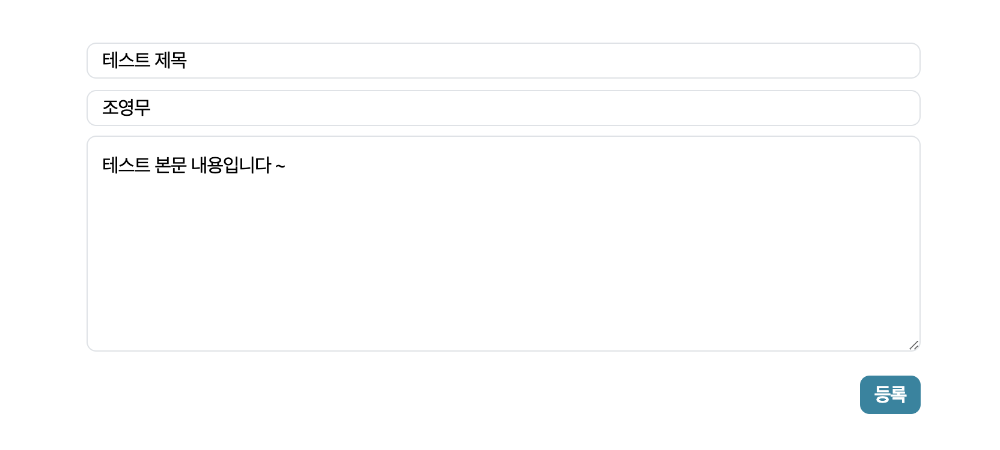

## Blog
https://velog.io/@fprh13/Spring-boot-MyBatis-사용하기-2-익숙하지-않은-기술에-경험을-쌓자

## 목표 🏆

- jpa가 아닌 다른 DB 접근 기술을 활용하자 (MyBatis)
- gradle이 아닌 maven을 이용하자
- mysql이 아닌 h2 내장 DB를 적극 활용하자
- yml 형식이 아닌 properties를 사용해보자

 

제가 항상 늘 사용하던 ..jpa...gradle..mysql...yml...없이...

 

## 기능
- 페이징 기능 -> ajax 로 더 보기 기능

- 글 등록 -> ajax post 요청

 

